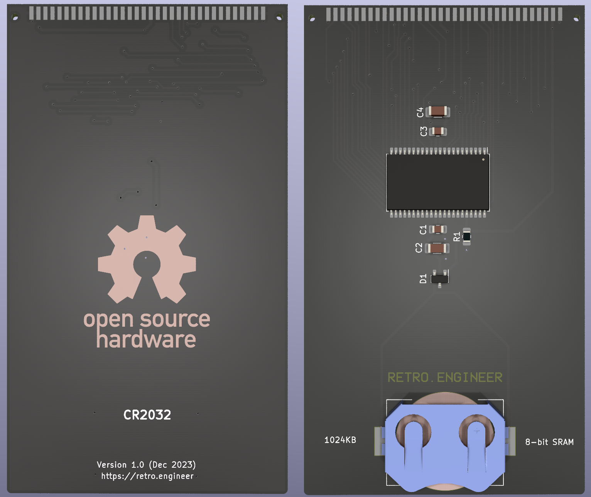
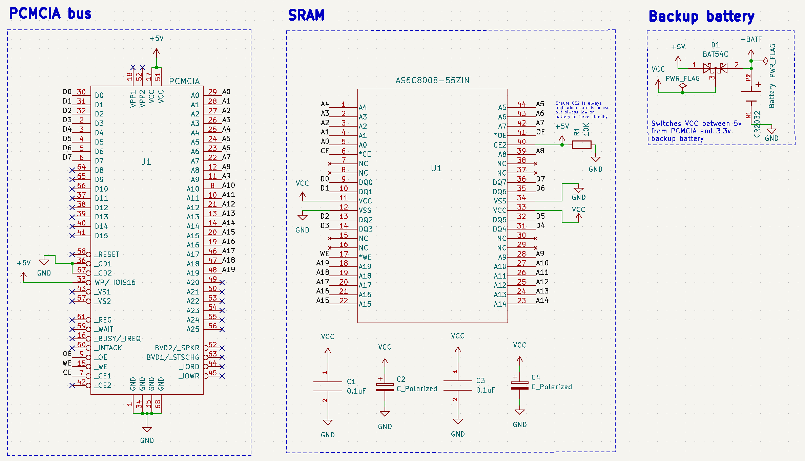

# PCMCIA SRAM board

This board is primarily designed for use in the Amstrad NC-100 and NC-200 portable computers, but will likely work in other computers as well.

## Specifications:
+ 1024K * 8 bits static RAM
+ CR2032 backup battery
+ Long battery life expected, but not yet tested

## Potential issues
+ This project has not yet been fully tested! **Build it at your own risk!**
+ Will likely not work in computers that expect a 16bit card, but this hasn't been tested
+ Currently no write protect switch

## Design
+ This product is Open Source, licensed under [CERN-OHL-P v2](https://ohwr.org/cern_ohl_p_v2.txt)
+ The schematics and PCB designs have been produced with KiCAD

